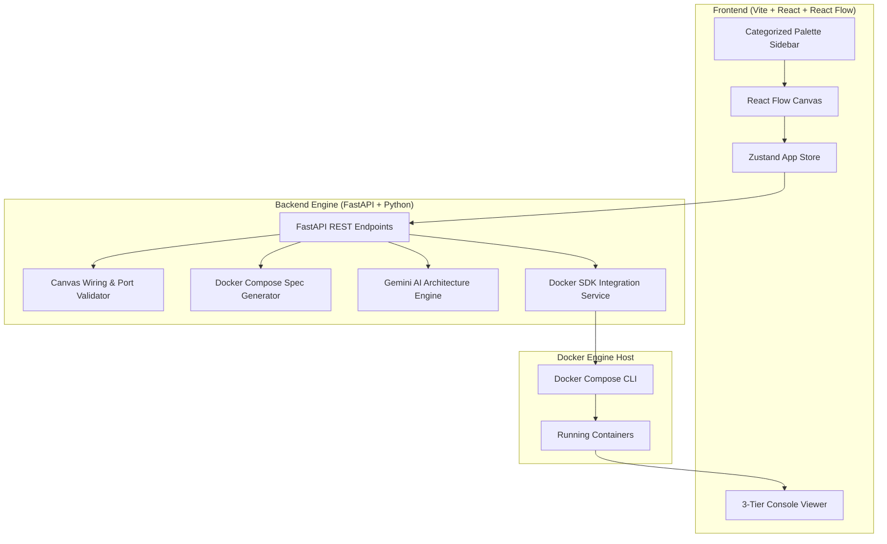

# 🐳 VisualDocker

The **VisualDocker** platform is an interactive, visual modeling platform and deployment manager for Docker containers, custom bridge networks, named volumes, port mappings, and environment variables. It empowers developers and DevOps engineers to visually design microservice topologies on an intuitive React Flow canvas and deploy them directly onto a Docker engine via FastAPI and Docker Compose.

---

## 🌟 Key Features

- 🎨 **Interactive Node Canvas**: Drag-and-drop workflow powered by React Flow with custom nodes for **Containers**, **Networks**, **Volumes**, **Ports**, and **Environment Variables**.
- 🔒 **Strict Directional Flow Rules**: Built-in edge connection validation preventing invalid schema connections (e.g. connecting ports or env vars directly to network bridges).
- ⚡ **Dynamic `docker-compose.yml` Generator**: Automatically converts canvas node and edge graphs into standard `docker-compose.yml` declarations.
- 🔄 **Automatic Host Port Collision Shift**: Scans the host network to automatically shift occupied host ports (e.g. `80:80` $\rightarrow$ `8080:80`) without crashing stack deployment.
- 💬 **Gemini AI Architecture Assistant**: Converts natural language requests into structured canvas node topologies using Google Gemini API.
- 📊 **3-Tier Telemetry & Log Console**: Live container metrics (status, memory, CPU %, uptime), deployment execution logs, and interactive CLI debugging.

---

## 🏛️ System Architecture



---

## 🛠️ Technology Stack

### **Frontend**
- **Framework**: [React 18](https://react.dev/) + [Vite](https://vitejs.dev/)
- **Language**: TypeScript
- **Canvas Library**: [@xyflow/react (React Flow)](https://reactflow.dev/)
- **State Management**: [Zustand](https://zustand-demo.pmnd.rs/)
- **Icons**: [Lucide React](https://lucide.dev/)
- **HTTP Client**: Axios

### **Backend**
- **Framework**: [FastAPI](https://fastapi.tiangolo.com/)
- **Server**: [Uvicorn](https://www.uvicorn.org/)
- **Container SDK**: [Docker SDK for Python](https://docker-py.readthedocs.io/)
- **Data Validation**: [Pydantic v2](https://docs.pydantic.dev/)
- **YAML Engine**: PyYAML
- **AI Integration**: Google Generative AI (`google-generativeai`)

---

## 📂 Project Structure

```
├── backend/
│   ├── app/
│   │   ├── docker/          # Docker SDK & Compose CLI interface service
│   │   ├── engine/          # Validation, compose generator & AI assistant modules
│   │   ├── models/          # Pydantic schema models for nodes, edges & graphs
│   │   └── main.py          # FastAPI application & REST API endpoints
│   ├── requirements.txt     # Backend Python dependencies
│   └── test_engine.py       # Engine generator unit tests
├── frontend/
│   ├── src/
│   │   ├── canvas/          # React Flow canvas setup & connection handlers
│   │   ├── components/      # UI components (Console, Sidebar, Header)
│   │   ├── nodes/           # Custom React Flow Node components
│   │   ├── store/           # Zustand graph & app state store
│   │   ├── App.tsx          # Main layout view
│   │   └── main.tsx         # Application entrypoint
│   ├── package.json         # Frontend Node dependencies & scripts
│   └── vite.config.ts       # Vite bundler config
├── architecture.md          # Detailed architecture & sequence flow diagrams
└── instructions.md          # Setup instructions & usage reference
```

---

## 🛠️ Prerequisites

Ensure the following tools are installed on your host machine:

- **Node.js**: `v18.0.0` or higher ([Download](https://nodejs.org/))
- **Python**: `v3.10`, `v3.11`, or `v3.13` ([Download](https://www.python.org/))
- **Docker Desktop**: Running with Docker Compose support ([Download](https://www.docker.com/products/docker-desktop/))

---

## 🚀 Quick Start & Setup Guide

### 1. Backend Setup (FastAPI)

1. Open terminal and navigate to the `backend` directory:
   ```bash
   cd backend
   ```

2. Create and activate a Python virtual environment:
   - **Windows (PowerShell)**:
     ```powershell
     python -m venv venv
     .\venv\Scripts\activate
     ```
   - **Linux / macOS**:
     ```bash
     python3 -m venv venv
     source venv/bin/activate
     ```

3. Install required Python packages:
   ```bash
   pip install -r requirements.txt
   ```

4. *(Optional)* Set your Gemini API key in a `.env` file inside `backend/`:
   ```env
   GEMINI_API_KEY=your_gemini_api_key_here
   ```

5. Launch the FastAPI backend server:
   ```bash
   uvicorn app.main:app --reload --port 8000
   ```
   - API operational at: `http://localhost:8000`
   - Interactive Swagger API Docs: `http://localhost:8000/docs`

---

### 2. Frontend Setup (React + Vite)

1. Open a second terminal window and navigate to the `frontend` directory:
   ```bash
   cd frontend
   ```

2. Install Node.js dependencies:
   ```bash
   npm install
   ```

3. Start the Vite development server:
   ```bash
   npm run dev
   ```

4. Open your browser and access the application at:
   ```
   http://localhost:5173
   ```

---

## 🎨 Node Types & Connection Rules

### Node Palette

| Node Type | Handle Role | Description |
| :--- | :--- | :--- |
| 📦 **Container** | Target (Left) / Source (Right) | Represents a Docker container (e.g. `fastapi`, `postgres`, `redis`). |
| 🌐 **Network** | Source (Right) | Custom Docker bridge network (e.g. `frontend-net`, `backend-net`). |
| 💾 **Volume** | Source (Right) | Named persistent volume mount (e.g. `db_data`, `redis_data`). |
| 🔌 **Port** | Target (Left) | Host-to-Container port binding (e.g. `80:8000`). |
| 🔑 **Environment** | Target (Left) | Environment variable key-value bindings. |

### Wiring Rules

- **Left Handle (Target)**: Accepts inputs, configuration, environment variables, host ports, or incoming container links.
- **Right Handle (Source)**: Emits outputs, network connections, volume mounts, or outbound service dependencies.

---

## 🔌 API Endpoints Summary

| Method | Endpoint | Description |
| :--- | :--- | :--- |
| `GET` | `/` | Health check and API status. |
| `POST` | `/api/validate` | Validates graph wiring & handle directional schema. |
| `POST` | `/api/generate` | Generates `docker-compose.yml` content from canvas graph. |
| `POST` | `/api/deployments/up` | Validates, generates Compose spec, and deploys container stack. |
| `GET` | `/api/deployments/status` | Returns live running status & resource metrics for containers. |
| `GET` | `/api/deployments/logs/{container_id}` | Streams deployment stdout/stderr logs for a specific container. |
| `POST` | `/api/ai/suggest` | Generates canvas graph JSON from natural language prompts using Gemini. |

---

## 🔍 Troubleshooting

| Issue | Potential Cause | Recommended Fix |
| :--- | :--- | :--- |
| `500 Internal Server Error` on stack deployment | Docker Desktop is not running | Launch Docker Desktop on host system. |
| Container constantly restarting or crashing | Base image missing entrypoint executable | Set container command override to `tail -f /dev/null` to keep container daemonized. |
| `Port 80 is already allocated` | Another host process is using port 80 | The auto-shift engine will auto-increment to `8080:80`. Alternatively, edit the Port Node on canvas. |

---

## 📄 License

This project is licensed under the MIT License.
