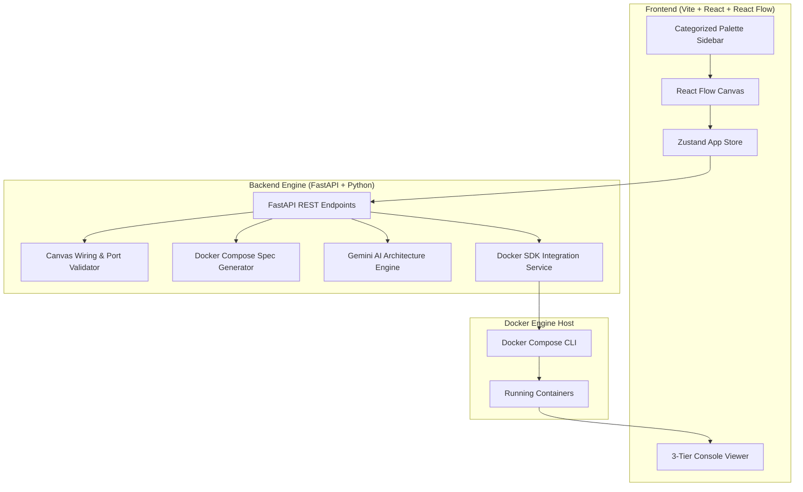
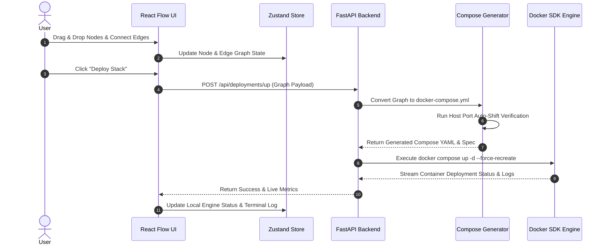

# Architecture & System Design Document

## VisualDocker

The **VisualDocker** platform is a modern visual modeling tool and runtime deployment manager designed for Docker containers, networks, volumes, and microservice topologies.

---

## 🏛️ System Architecture Overview

---

## 🔄 Core Execution Flow

---

## 💡 Key Subsystems

### 1. Canvas Connection & Handle Flow Rules
* **Directional Enforcement**:
  * **Target (Left)**: Inputs, configuration parameters, environment nodes, port mappings.
  * **Source (Right)**: Outputs, network interfaces, volume mounts, container dependencies.
* **Validation Engine**: Prevents invalid edge connections (e.g. connecting an environment node directly to a network node).

### 2. Docker Compose Generator & Auto-Port Shift
* Dynamically scans host network interfaces to verify if mapped host ports are free.
* Auto-allocates available host ports if collision is detected (e.g. `80:80` $\rightarrow$ `8080:80`).
* Supports command overrides (`tail -f /dev/null`) for persistent daemonized runtime containers.

### 3. Live 3-Tier Console & Telemetry
1. **Local Engine Status Table**: Displays container name, ID, status (`● RUNNING`, `OFFLINE`), memory usage, CPU %, and uptime.
2. **Deployment Output Console**: Structured timestamped log window powered by IBM Plex Mono typography.
3. **Interactive Terminal**: CLI interface for container inspection.
